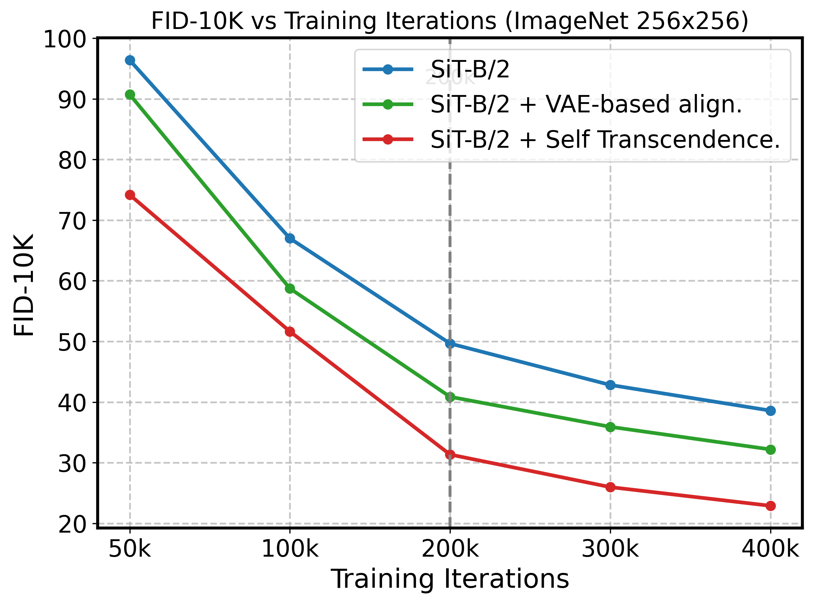

<div align="center">
<h2>Beyond External Guidance: <br>Unleashing the Semantic Richness Inside Diffusion Transformers for Improved Training</h2>

<a href=''></a>


[Lingchen Sun](https://scholar.google.com/citations?hl=zh-CN&tzom=-480&user=ZCDjTn8AAAAJ)<sup>1,2</sup>
| [Rongyuan Wu](https://scholar.google.com/citations?user=A-U8zE8AAAAJ&hl=zh-CN)<sup>1,2</sup> | 
[Zhengqiang Zhang](https://scholar.google.com/citations?user=UX26wSMAAAAJ&hl=en)<sup>1</sup> | 
[Ruibin Li](https://scholar.google.com/citations?user=FMNs2K0AAAAJ&hl=en)<sup>1</sup> | 
[Yujing Sun](https://scholar.google.com/citations?user=kj3VUSwAAAAJ&hl=en)<sup>1,2</sup> |
[Shuaizheng Liu](https://scholar.google.com/citations?user=wzdCc-QAAAAJ&hl=zh-CN)<sup>1,2</sup> |
[Lei Zhang](https://www4.comp.polyu.edu.hk/~cslzhang)<sup>1,2</sup>

<sup>1</sup>The Hong Kong Polytechnic University, <sup>2</sup>OPPO Research Institute
</div>


## 🧡ྀི Summary
We answer this question: ***Can internal features be used as effective semantic guidance signals to improve the training of DiT models?*** and introduce *Self-Transcendence*, a simple yet effective self-guided training strategy achieving REPA-level performance without any external feature supervision. Our proposed approach produces more discriminative and semantically richer features than pre-trained DINO used in [REPA](https://github.com/sihyun-yu/REPA). Our method significantly improves training efficiency and generation quality, *acheiving FID=1.25 at just 400 epochs*.


## ⏰ Update
- **2026.1.12**: The paper and this repo are released.

:star: If Self-Transcendence is helpful to your images or projects, please help star this repo. Thanks! :hugs:


## 🌟 Overview framework
We find that the most effective guiding features should meet **two criteria**:  

(1) *they should have a clean structure, in the sense that they can effectively help shallow blocks distinguish noise from signal*.

(2) *they should be semantically discriminative, making it easier for shallow layers to learn effective representations*.

With these considerations, we propose a two-stage training framework.

<div align="center">

</div>
(a) Firstly, we use clean VAE features as guidance to help the model distinguish useful information from noise in shallow layers. 

(b) After a certain number of iterations, the model has learned more meaningful representations. We then freeze this model and use its representation as a fixed teacher. To enhance the semantic expression in the features, we build a self-guided representation that better aligns with the target conditions.

<div align="center">

</div>

VAE-based alignment accelerates SiT training, while leveraging this model for self-transcendence leads to further improvements.


### Citations

If our code helps your research or work, please consider citing our paper.
The following are BibTeX references:

```
@article{sun2026self-transcendence,
  title={Beyond External Guidance: Unleashing the Semantic Richness Inside Diffusion Transformers for Improved Training},
  author={Sun, Lingchen and Wu, Rongyuan and Zhang, Zhengqiang and Li, Ruibin and Sun, Yujing and Liu, Shuaizheng and Zhang, Lei},
  journal={arXiv preprint arXiv: },
  year={2026}
}
```


### License
This project is released under the [Apache 2.0 license](LICENSE).

### Acknowledgement
This project is based on [REPA](https://github.com/sihyun-yu/REPA). Thanks for the awesome work. 

### Contact
If you have any questions, please contact: ling-chen.sun@connect.polyu.hk


<details>
<summary>statistics</summary>


</details>
