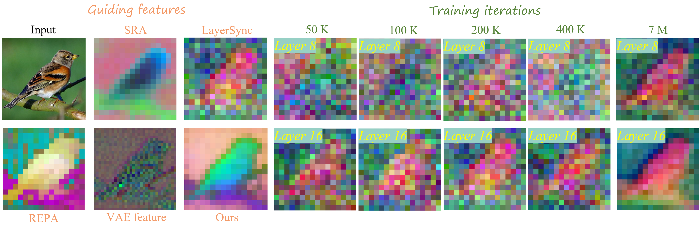
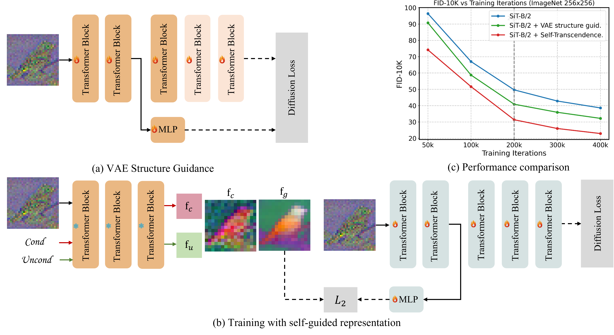

<div align="center">


<h2>Self-transcendence: <br>  Is External Feature Guidance Indispensable for Accelerating Diffusion Transformer Training?</h2>


<a href='https://arxiv.org/pdf/2601.07773'></a> </a>
<!-- <a href='https://yjsunnn.github.io/Self-Transcendence-project/'> --> 


[Lingchen Sun](https://scholar.google.com/citations?hl=zh-CN&tzom=-480&user=ZCDjTn8AAAAJ)<sup>1,2</sup>
| [Rongyuan Wu](https://scholar.google.com/citations?user=A-U8zE8AAAAJ&hl=zh-CN)<sup>1,2</sup> | 
[Zhengqiang Zhang](https://scholar.google.com/citations?user=UX26wSMAAAAJ&hl=en)<sup>1</sup> | 
[Ruibin Li](https://scholar.google.com/citations?user=FMNs2K0AAAAJ&hl=en)<sup>1</sup> | 
[Yujing Sun](https://scholar.google.com/citations?user=kj3VUSwAAAAJ&hl=en)<sup>1,2</sup> |
[Shuaizheng Liu](https://scholar.google.com/citations?user=wzdCc-QAAAAJ&hl=zh-CN)<sup>1,2</sup> |
[Lei Zhang](https://www4.comp.polyu.edu.hk/~cslzhang)<sup>1,2</sup>

<sup>1</sup>The Hong Kong Polytechnic University, <sup>2</sup>OPPO Research Institute
</div>


## 🧡ྀི Summary
Both shallower and deeper layers gradually learn more discriminative patterns over time, but the shallower layer progresses very slowly. This indicates that the slow convergence of DiT is mainly due to the difficulty in learning clean and semantically rich features in shallow layers.

We answer this question: **Is external feature
guidance indispensable for accelerating diffusion transformer training?** and introduce *Self-Transcendence*, a simple yet effective self-guided training strategy surpassing the performance of REPA without any external feature supervision. Our proposed approach produces more discriminative and semantically richer features than pre-trained DINO used in [REPA](https://github.com/sihyun-yu/REPA). Our method significantly improves training efficiency and generation quality, *acheiving FID=1.25 at just 400 epochs*.





## ⏰ Update
- **2026.3.15**: Code and models are released.
- **2026.1.12**: The paper and this repo are released.

:star: If Self-Transcendence is helpful to your images or projects, please help star this repo. Thanks! :hugs:


## 🌟 Overview framework
We find that the most effective guiding features should meet **two criteria**:  

(1) *they should have a **clean structure**, in the sense that they can effectively help shallow blocks distinguish noise from signal*.

(2) *they should be **semantically discriminative**, making it easier for shallow layers to learn effective representations*.

With these considerations, we propose a two-stage training framework.

<div align="center">

</div>
(a) Firstly, we use clean VAE features as guidance to help the model distinguish useful information from noise in shallow layers. 

(b) After a certain number of iterations, the model has learned more meaningful representations. We then freeze this model and use its representation as a fixed teacher. To enhance the semantic expression in the features, we build a self-guided representation that better aligns with the target conditions.

(c) VAE structure guidance accelerates SiT training, while leveraging this model for self-transcendence leads to further improvements.


## ⚙ Dependencies and Installation
```shell
## git clone this repository
git clone https://github.com/csslc/Self-Transcendence.git
cd Self-Transcendence


# create an environment
conda create -n Self-Transcendence python=3.9 -y
conda activate Self-Transcendence
pip install --upgrade pip
pip install -r requirements.txt
```

## 🍭 Quick Inference
#### Step 1: Download the pretrained models
Download the Self-Transcendence model from [`obox(pwd: SelfTrans315)`](https://sbox.myoas.com/l/B1b213930e1088174).

#### Step 3: Running testing command 
```
torchrun --nnodes=1 --nproc_per_node=8 --master-port=29510 generate.py \
  --model SiT-XL/2 \
  --ckpt pretrained_models/self-trans/sit_xl/2000000.pt \
  --sample-dir test_results/self-trans/sit-xl \
  --num-fid-samples 50000 \
  --path-type=linear \
  --encoder-depth=8 \
  --projector-embed-dims=768 \
  --per-proc-batch-size=64 \
  --mode=sde \
  --num-steps=250 \
  --cfg-scale=1.9 \
  --resolution=256 \
  --guidance-high=0.65
```

## 🚋 Train 
#### Step1: Prepare training data
We provide experiments for ImageNet (C2I) and MSCoCo (T2I). You can place the data that you want and can specifiy it via --data-dir arguments in training scripts. Please refer to our [preprocessing](https://github.com/csslc/Self-Transcendence/tree/main/preprocessing) guide.

#### Step2: Train Model
1. Train the guiding model with the VAE stucture guidance loss:
    ```shell
    accelerate launch train_vaeloss.py \
    --report-to="wandb" \
    --allow-tf32 \
    --mixed-precision="fp16" \
    --seed=0 \
    --path-type="linear" \
    --prediction="v" \
    --weighting="uniform" \
    --model="SiT-B/2" \
    --proj-coeff=0.5 \
    --encoder-depth=2 \
    --output-dir="exps/vaeloss" \
    --t-range 0.4 0.7 \
    --resolution 256 \
    --exp-name="sit-b-256" \
    --data-dir=".../data"
    ```

2. Train the model with the self-guided representation:
  ```shell
    accelerate launch train_vaeloss.py \
    --report-to="wandb" \
    --allow-tf32 \
    --mixed-precision="fp16" \
    --seed=0 \
    --path-type="linear" \
    --prediction="v" \
    --weighting="uniform" \
    --model="SiT-B/2" \
    --proj-coeff=0.5 \
    --encoder-depth=2 \
    --output-dir="exps/vaeloss" \
    --t-range 0.4 0.7 \
    --resolution 256 \
    --exp-name="sit-b-256" \
    --data-dir=".../data"
    ```

### Citations

If our code helps your research or work, please consider citing our paper.
The following are BibTeX references:

```
@article{sun2026selftrans,
  title={Self-transcendence: Is External Feature Guidance Indispensable for Accelerating Diffusion Transformer Training?},
  author={Sun, Lingchen and Wu, Rongyuan and Zhang, Zhengqiang and Li, Ruibin and Sun, Yujing and Liu, Shuaizheng and Zhang, Lei},
  journal={arXiv preprint arXiv: 2601.07773},
  year={2026}
}
```


### License
This project is released under the [Apache 2.0 license](LICENSE).

### Acknowledgement
This project is based on [REPA](https://github.com/sihyun-yu/REPA) and [U-ViT](https://github.com/baofff/U-ViT). Thanks for the awesome works. 

### Contact
If you have any questions, please contact: ling-chen.sun@connect.polyu.hk


<details>
<summary>statistics</summary>


</details>
